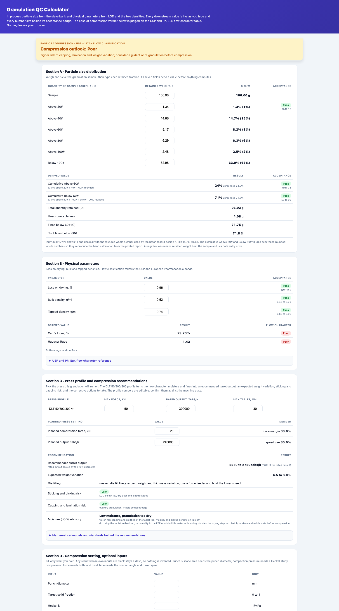

<div align="center">

# Granulation QC Calculator

**Turns in process sieve and physical granulation data into the batch record figures every granulation section fills out, with USP and Ph. Eur. flow classification and a plain language ease of compression verdict.**

[](#)
[](#)
[](#)
[](#)
[](https://marknwilliam.github.io/granulation-qc-calculator/)

</div>

---



## About

In process granulation control lives on a fixed set of figures: the sieve analysis, the loss on drying, the bulk and tapped densities, and the flow character they imply. This tool types those raw weights and values in and gets every downstream number back live, the % w/w per sieve, the cumulative Above 60# and Below 60# figures that the batch record uses, total retained, unaccountable loss, fines below 60# by the alternate BMR calculation, Carr's Index and Hausner Ratio, all of them against their acceptance badges. Once the whole form is complete the page prints one verdict on how easy or hard that granulation will be to compress, judged using the USP and Ph. Eur. flow character table.

The rounding follows the plant convention exactly: each individual % w/w is shown to one decimal with the rounded whole number the batch record uses beside it, like 14.7% (15%), and the cumulative figures sum those rounded whole numbers so the printout reproduces the hand calculation. Standard round half up is used everywhere, so a floating point artifact like 71.74999999 never appears. Nothing is sent anywhere, everything runs in the browser, and the same math ships as a tiny pure python library for scripts and tests.

## Using the calculator

Section A wants the sample weight in grams and the retained weight on each of the six sieves. All seven fields must have a value before any number in the section computes, until then every output stays a dash. Each sieve row shows its % w/w with the whole number in brackets, and above 20#, above 60# cumulative and below 60# cumulative each get a live Pass or Fail badge against their limits of NMT 15%, NMT 35% and 50 to 90%. Derived rows give D, the unaccountable loss in red when retained beats the sample, and the fines below 60# cross check with its inline note when the two roundings diverge by more than one percentage point.

Section B badges LOD against NMT 2.5, bulk density against 0.40 to 0.70 and tapped density against 0.65 to 0.95, then computes Carr's Index and Hausner Ratio the moment both densities are in, tagging each with its flow character band. When the two ratings differ, both show and the worse one drives.

Section C carries the press profile. The DLT 50/300/300 is loaded with an editable maximum force, rated output and maximum tablet size, so confirm the numbers against the machine plate. With the batch complete the tool recommends a permissible turret output as a band of tablets per hour and a percent of the press rating, the flow character setting the factor, an expected weight variation band, and a die fill note. It scores sticking and picking risk and capping and lamination risk from the LOD, the fines, the oversize, the flow rating and the planned press settings, listing each contributing factor, and it prints the moisture window advisory with the corrective actions, re humidify when too dry, re dry and re lubricate when too wet.

Section D is optional and takes only what you hold. Punch diameter gives the punch surface area A = pi x (d/2)^2. Contact angle and turret speed give the dwell time t = (contact angle / 360) x (60 / rpm). A Heckel study, that is k and A plus a target solid fraction, gives the compaction pressure P = (ln(1 / (1 - D)) - A) / k, and pressure with area gives the force F = P x A with 1 MPa equal to 1 N/mm2. Every result stays a dash until its own inputs are present, so the tool never invents a force from granulation data alone.

The recommendation engine leans on standard models: Carr and Hausner for flow and compressibility read with USP <1174>, the Beverloo orifice flow law for die fill, the dwell time relation t = (contact angle / 360) x (60 / rpm), and the Heckel, Ryshkewitch-Duckworth and Leuenberger compaction models that explain capping and lamination. The in process specification and USP <905> frame the weight variation. All of it is advisory and is confirmed on the first compression.

The sticky verdict appears only when both sections are complete. It starts from the worse of the Carr's and Hausner ratings, steps down one level when fines sit below 50% or above 90%, steps down another when above 20# beats 15%, and clamps at the ends of the flow table. The Reset button clears everything back to a blank form.

## Quick start

```bash
cat > gran.json <<'EOF'
{
  "sample_g": 100.00,
  "retained": {"above20": 1.34, "above40": 14.66, "above60": 8.17,
               "above80": 6.29, "above100": 2.48, "below100": 62.98},
  "lod": 0.96, "bulk_density": 0.52, "tapped_density": 0.74
}
EOF
```

```bash
python3 -m unittest test_granulation_qc.py
```

Worked example batch QK260454: % w/w reads 1.3% (1%), 14.7% (15%), 8.2% (8%), 6.3% (6%), 2.5% (2%), 63.0% (63%). Above 60# cumulative is 24% and passes NMT 35%, below 60# cumulative is 71% and passes 50 to 90%. D is 95.92 g, loss 4.08 g, fines below 60# come to 71.75 g or 71.8%. Carr's Index is 29.73% and Hausner Ratio is 1.42, both landing in the Poor band on the USP and Ph. Eur. table. No further downgrades trigger, so the compression outlook is Poor with the guidance to watch for capping, lamination and weight variation.

## Repository layout

```
granulation-qc-calculator/
├── index.html             # interactive dashboard (open this)
├── granulation_qc.py      # sieve, flow and verdict library + helpers
├── test_granulation_qc.py # 54 unit tests
├── docs/                  # README preview screenshot
└── README.md
```

## License

MIT.